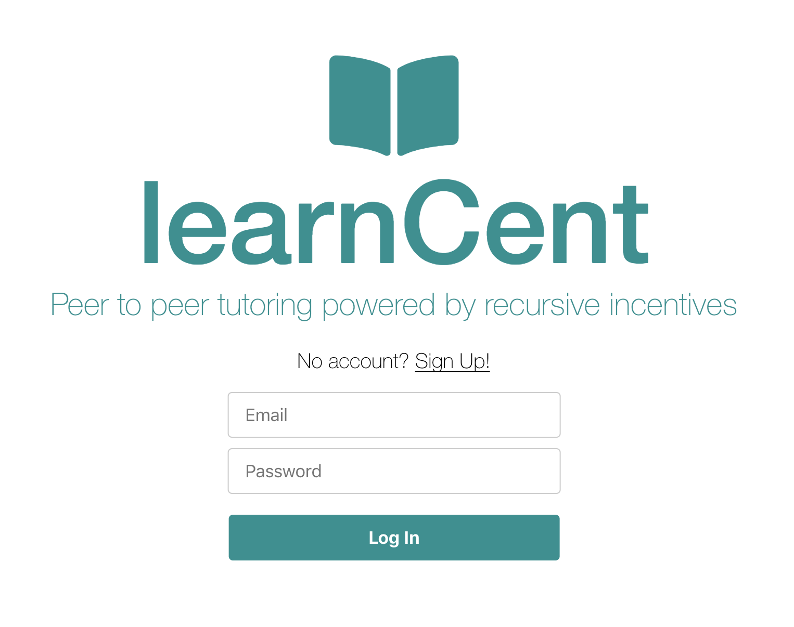
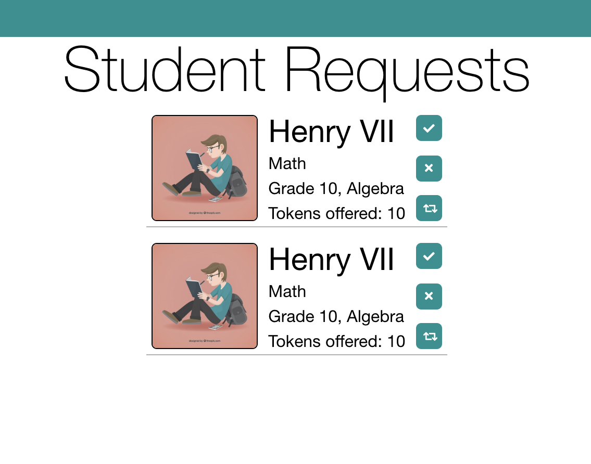

# learnCent
Peer to peer tutoring powered by recursive incentives

## Live
  Learn about [learnCent](https://wittiest.github.io/learnCent/)


## Code
  Find our public code [here](https://github.com/ncent/ncent.github.io/tree/master/hackCent/August2018/learnCent).

  ### Highlights

  StellarSdk and nCentSdk interactions:
  ```javascript
  const ncentSDK = require('../../../../../SDK/source/ncentSDK');
  const sdk = new ncentSDK();
  const StellarSdk = require('stellar-sdk');

  const createKeypair = () => {
    const wallet = sdk.createWalletAddress();
    const publicKey = wallet.publicKey();
    const privateKey = StellarSdk.StrKey.encodeEd25519SecretSeed(wallet._secretSeed);
    return ({publicKey, privateKey});
  };

  const stampUniversityToken = (university) => {
    const TOKEN_AMOUNT = 100000;
    const EXPIRATION_DATE = '2021';
    const TOKEN_NAME = `${university.dataValues.name}Cent`;
    return (
      new Promise(function(resolve, reject) {
          return sdk.stampToken(
            university.dataValues.public_key,
            TOKEN_NAME,
            TOKEN_AMOUNT,
            EXPIRATION_DATE,
            resolve,
            reject
          );
      })
      .then(function(response) {
          console.log("Created a universityToken:", response.data);
          const tokenId = response.data["uuid"];
          university.token_id = tokenId;
      })
      .catch(function(error) {
          console.log(error);
      })
    );
  };

  const createWalletFromPrivateString = (privateKeyString) => {
    const wallet = StellarSdk.KeyPair.fromSecret(privateKeyString);
    return wallet;
  };
  ```

  Output of `stampUniversityToken` function from above
  ```
    created a Token:
    { uuid: '7ee13459-ff75-4a68-b2f1-fb2937a62e48',
      Name: 'StanfordCent',
      ExpiryDate: '2021-01-01T00:00:00.000Z',
      sponsor_uuid: 'GDSSKHNUYXXQRSCDRKXWHXE7VS7CPECGT2ZIPXKXOAQ74TCUM2SM2QN2',
      totalTokens: 100000,
      updatedAt: '2018-08-23T18:33:13.738Z',
      createdAt: '2018-08-23T18:33:13.738Z' }
    Seeded 1 universities OK
    Seeded 5 users OK
    Seeded 1 requests OK
  ```

## Information
learnCent is founded on the simple idea of fixing a search problem at universities. Universities are notorious for inefficient spending. Students have problems getting help with homework. What if we could fix both of these problems?

Universities will stamp learnCent tokens for student use. Similar to university meal cards, students will receive these tokens at the beginning of a semester to spend on tutors. Universities benefit from a public ledger; students benefit from the entire student body being incentivized to recruit tutors for each other.

How are students incentivized to help? Simple. A request for a tutor will be powered by a recursive incentive where the individuals who referred the tutor or referred the person who referred the tutor (or referred that person...so on), will receive a portion of the initial budget allocated.

Read more about recursive incentives in [nCent's litepaper](https://ncent.io/Applications/landingPage/LitePaper.pdf)

## Design






